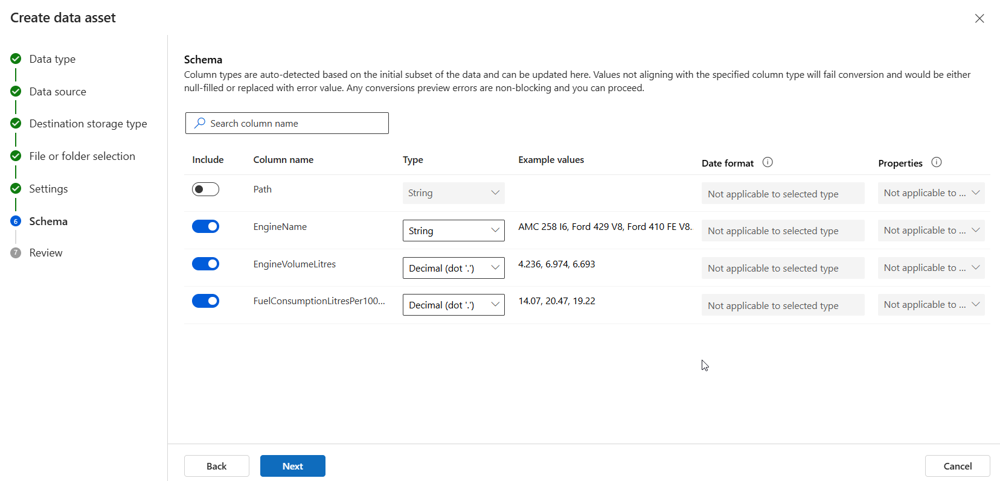
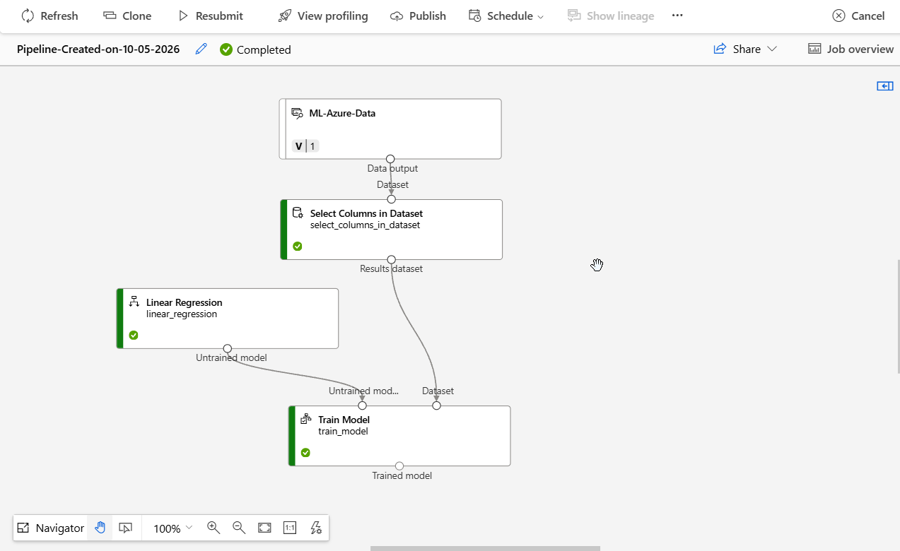
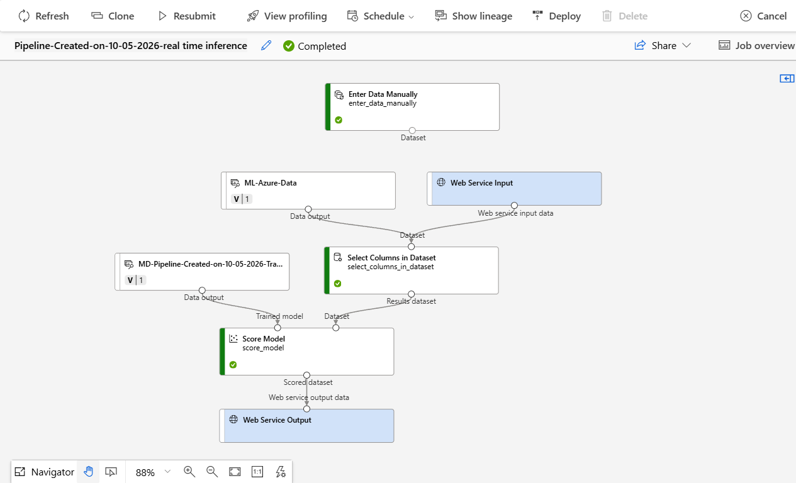

# Azure ML - Linear Regression

## STEG 1 - Skapa Azure Machine Learning Workspace

- Gå till Azure Portal.
- Sök efter: "Azure Machine Learning" och klicka på "Create" och välj "New Workspace".
- Fyll i nödvändig information som prenumeration, resursgrupp, arbetsytans namn och region.
- Klicka på "Review + Create" och sedan "Create" för att skapa arbetsytan.


- När arbetsytan har skapats, gå till den genom att klicka på "Go to resource".


- Klicka på "Launch studio" för att öppna Azure Machine Learning Studio.

## Steg 2 - Lägg in engine_data.csv (Eller annan data) i Azure ML

- Klicka på "Data" i vänstermenyn.
- Klicka sedan på "Create".
- Skriv ett namn och typ för din datatillgång.


- Klicka på "Next" och välj "From local files" för att ladda upp din CSV-fil (t.ex. engine_data.csv).
- Klicka på "Next" och sedan välj "Välj ett datalager" (t.ex. "Azure Blob Storage").


- Klicka på "Next" och sedan välj "Upload files" för att ladda upp din CSV-fil, och Klicka på "Next".
- Sedan man kan se "Förhandsgranskning av data" och klicka på "Next".
- Azure bör visa columns och datatyper för din CSV-fil.



- Klicka på "Next" och sedan "Create" för att skapa datatillgången.

## Steg 3 - Skapa Training Pipeline

- Klicka på "Designer" i vänstermenyn.
- Klicka på "Create new pipeline". Du ska nu komma till en tom canvas.
- Lägg till vårt Data Asset genom att klicka på "Datasets" i vänstermenyn och dra in den till canvasen.


- Klicka på "Component" i vänstermenyn och söka efter "Select Columns in Dataset" och dra in den till canvasen.
- Koppla sedan Data Asset output till Select Columns in Dataset input.
- Klicka på Select Columns in Dataset. I inställningarna hittar du: Edit column


- Klicka på "Edit column" och välj de kolumner du vill använda i din modell. Klicka sedan på "Save".
- Lägg till Linear Regression genom att klicka på "Component" i vänstermenyn och söka efter "Linear Regression" och dra in den till canvasen.
- Konfigurera den som du ser i bilden nedan:


- Lägg till Train Model genom att klicka på "Component" i vänstermenyn och söka efter "Train Model" och dra in den till canvasen.
- Koppla Select Columns in Dataset output till Train Model input och Linear Regression output till Train Model input.
- Välj Label Column i Train Model inställningarna. Detta är kolumnen som modellen ska förutsäga. (i vårt exempel är det "FuelConsumptionLitresPer100Km").


- Efter att ha konfigurerat Train Model, Klicka på "Save" och sedan Klicka "Configure & Submit".
- Sedan skriver du ett namn för din pipeline och klickar på "Next" och "Next" igen.
- Efter det, Välj din Azure ML compute om du har en, annars skapa en.


- Klicka på "Next" och sedan "Submit"
- Vi vänter tills vi får meddelandet "Success: Pipeline job has been submitted".
- Sedan klikar man på "View Details" och vänter tills jobben är klara. så får man meddelandet "Completed".
- Det ser ut som nedan:



## Steg 4 - Lägg till Score Model

- Gå tillbaka till din pipeline Genom att klicka på "Designer" i vänstermenyn, sedan välj din pipeline.
- Klicka på "Component" i vänstermenyn och söka efter "Score Model" och dra in den till canvasen.
- Koppla Train Model output till Score Model input, och sedan koppla Select Columns in Dataset output till Score Model input.


- Klicka på "Save" och sedan Klicka "Configure & Submit".
- Sedan skriver du ett namn för din pipeline och klickar på "Next" och "Next" igen.
- Efter det, Välj din Azure ML compute om du har en, annars skapa en.
- Klicka på "Next" och sedan "Submit"
- Vi vänter tills vi får meddelandet "Success: Pipeline job has been submitted".
- Sedan klikar man på "View Details" och vänter tills jobben är klara. så får man meddelandet "Completed".

## Steg 5 - Lägg till Evaluate Model

- Gå tillbaka till din pipeline Genom att klicka på "Designer" i vänstermenyn, sedan välj din pipeline.
- Klicka på "Component" i vänstermenyn och söka efter "Evaluate Model" och dra in den till canvasen.
- Koppla Score Model output till Evaluate Model input.
- Klicka på "Save" och sedan Klicka "Configure & Submit".
- Sedan skriver du ett namn för din pipeline och klickar på "Next" och "Next" igen.
- Efter det, Välj din Azure ML compute om du har en, annars skapa en.
- Klicka på "Next" och sedan "Submit"
- Vi vänter tills vi får meddelandet "Success: Pipeline job has been submitted".
- Sedan klikar man på "View Details" och vänter tills jobben är klara. så får man meddelandet "Completed".

```markdown
## Modellresultat

Den linjära regressionsmodellen uppnådde följande resultat:

- MAE: 0,637786
- RMSE: 0,799641
- R²: 0,971526

R² på 0,971526 innebär att modellen förklarar ungefär 97,15 % av
variationen i bränsleförbrukningen i datasetet.

Modellen använder `EngineVolumeLitres` för att förutsäga
`FuelConsumptionLitresPer100Km`.
```

## Steg 6 - Skapa Inference Pipeline

- Gå till Jobs i vänstermenyn och välj din pipeline.
- Sedan väljer du senaste pipeline jobben och öppnar den.
- I det övre högra hörnet klickar du på tre punkter och väljer "Create inference pipeline" och sedan väljer du "Real-time inference pipeline".
- Vänta tills Azure öppnar den nya inference-pipelinen


- Ta bort Evaluate Model.
- ägg till Web Service Input genom att klicka på "Component" i vänstermenyn och söka efter "Web Service Input" och dra in den till canvasen.
- Lägg till Enter Data Manually genom att klicka på "Component" i vänstermenyn och söka efter "Enter Data Manually" och dra in den till canvasen.
- Öppna Enter Data Manually och Vi ska skapa en enda kolumn, Exempeldata kan vara så här:


- Klicka på Select Columns in Dataset och öppna Edit column selection.
- Ta bort "FuelConsumptionLitresPer100Km" kolumnen och klicka på "Save".
- Klicka på "Save" och sedan Klicka "Configure & Submit".
- Sedan skriver du ett namn för din pipeline och klickar på "Next" och "Next" igen.
- Efter det, Välj din Azure ML compute om du har en, annars skapa en.
- Klicka på "Next" och sedan "Submit"
- Vi vänter tills vi får meddelandet "Success: Pipeline job has been submitted".
- Sedan klikar man på "View Details" och vänter tills jobben är klara. så får man meddelandet "Completed".
- Resultatet ser ut som nedan:



- Gå till Designer i vänstermenyn och öppna din Real-time inference pipeline.
- Ta bort ML-Azure-Data från den kopplingen och sedan kan du ta bort ML-Azure-Data.
- Koppla Enter Data Manually output till Select Columns in Dataset input.
- Klicka på "Save" och sedan Klicka "Configure & Submit".
- Sedan skriver du ett namn för din pipeline och klickar på "Next" och "Next" igen.
- Efter det, Välj din Azure ML compute om du har en, annars skapa en.
- Klicka på "Next" och sedan "Submit"
- Vi vänter tills vi får meddelandet "Success: Pipeline job has been submitted".
- Sedan klikar man på "View Details" och vänter tills jobben är klara. så får man meddelandet "Completed".
- Resultatet ser ut som nedan:


- Klicka på Deploy längst upp.
- Välj Real-time endpoint.
- Skapa en ny endpoint.
- Välj Azure Container Instance om det alternativet finns.
- Starta deployment.
- Först kommer du att få ungefär så här:


- Sedan behöver du vänta en stund till.

### Med stor sannolikhet kommer du inte att kunna göra en deploy, eftersom du behöver ge en RBAC-roll i Azure Portal så att Azure Machine Learning får rätt behörigheter för att skapa deploymenten.

- Gå till: Azure Portal → Resource groups → din Resource Group.
- Sedan: Access control (IAM) → Add → Add role assignment.
- Sök efter: Azure Container Instances Contributor Role.
- Välj rollen. Klicka Next.
- Välj User, group, or service principal.
- Klicka + Select members.
- Sök efter: ML-Linear-Regression.
- Välj ML-Linear-Regression och klicka Select.
- Klicka Next.
- Kontrollera att Scope är Resource group och att rätt Resource Group är - vald.
- Klicka Next.
- Kontrollera sammanfattningen.
- Klicka Review + assign.
- Klicka Review + assign igen för att bekräfta.
- Vänta några minuter så att den nya behörigheten hinner aktiveras.
- Gå tillbaka till Azure Machine Learning Studio → Endpoints → - engine-fuel-endpoint.
- Försök sedan göra deployment igen.

### Vänta sedan tills deployment visar:

- Deployment state: Healthy
- Operation state: Succeeded

## Steg 7 - Använd Azure ML Endpoint från C#

När endpointen är skapad och har status **Healthy** kan den användas från en extern applikation, till exempel en C#-applikation.

### 1. Gå till Consume

I Azure Machine Learning Studio:

- Gå till **Endpoints**.
- Öppna `engine-fuel-endpoint`.
- Klicka på **Consume**.

På denna sida hittar du bland annat:

- REST endpoint
- Primary key
- Swagger
- Kodexempel för bland annat C#, Python och JavaScript.

REST endpoint används för att skicka data till den tränade modellen.

Primary key används för att autentisera applikationen mot endpointen.

---

### 2. Använd `.env` för känslig information

API-nyckeln ska inte skrivas direkt i C#-koden och ska inte publiceras på GitHub.

Installera `DotNetEnv`:

```bash
dotnet add package DotNetEnv
